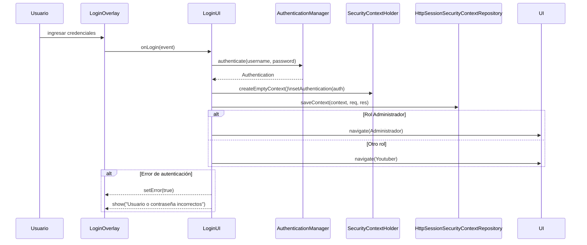

```mermaid
sequenceDiagram
    participant Usuario
    participant LoginOverlay
    participant LoginUI
    participant AuthMgr as AuthenticationManager
    participant SecCtx as SecurityContextHolder
    participant SessRepo as HttpSessionSecurityContextRepository
    participant UI

    Usuario->>LoginOverlay: ingresar credenciales
    LoginOverlay->>LoginUI: onLogin(event)
    LoginUI->>AuthMgr: authenticate(username, password)
    AuthMgr-->>LoginUI: Authentication

    LoginUI->>SecCtx: createEmptyContext()\nsetAuthentication(auth)
    LoginUI->>SessRepo: saveContext(context, req, res)

    alt Rol Administrador
        LoginUI->>UI: navigate(Administrador)
    else Otro rol
        LoginUI->>UI: navigate(Youtuber)
    end

    alt Error de autenticación
        LoginUI-->>LoginOverlay: setError(true)
        LoginUI-->>LoginOverlay: show("Usuario o contraseña incorrectos")
    end
```
